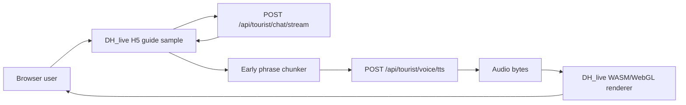

# DH_live Audio-Driven Digital Human Integration Design

**Date:** 2026-05-26
**Status:** Approved for planning
**Supersedes for prototype work:** `2026-05-26-live2d-digital-human-poc-design.md`

## 1. Purpose

Replace the current PNG-mouth animation experiment as the preferred realism path with a
`DH_live` proof of concept. The proof of concept must show that the existing scenic-guide
conversation and CosyVoice speech output can drive a video-based digital human whose lip
motion follows actual audio, while leaving the working mini-program experience available as
a fallback.

The first delivery is an isolated H5 sample, not a production replacement for the native
mini-program AI guide page.

## 2. Current Context

The current mini-program AI guide page:

- renders a PNG avatar through `miniprogram/src/components/DigitalHuman.vue`;
- streams answer text from `/api/tourist/chat/stream`;
- generates segmented TTS through `/api/tourist/voice/tts-sync`;
- drives five visual mouth states through returned `mouth_cues`.

This architecture has already improved playback latency, but its realism is bounded by
layered PNG assets and coarse mouth-state transitions.

`DH_live` uses a different rendering model:

- a prepared character video and associated feature data are loaded by its H5 renderer;
- a WebAssembly/WebGL2 pipeline derives facial and mouth animation from actual playback
  audio;
- no phoneme-to-PNG mouth mapping is required for the rendered character.

The repository demo has been run locally and has proven that a bundled character can render
and react to provided audio. It also shows that the demo resources are not automatically
production-ready: the sample character is branded and production authorization must be
confirmed separately.

## 3. Scope

### 3.1 First implementation slice

Build a standalone H5 digital-human sample in the existing project that:

- runs the locally staged `DH_live` web renderer and bundled demonstration character for
  technical validation only;
- uses the current FastAPI application as its conversation and TTS backend;
- streams assistant text into a simple guide conversation view;
- sends early text chunks to TTS and feeds returned audio bytes to `DH_live`;
- measures first-speech latency and exposes visible playback state for testing;
- can be opened in a desktop browser first and then assessed for a later WeChat `web-view`
  integration.

### 3.2 Out of scope for the first slice

- Replacing `miniprogram/src/pages/guide/guide.vue`.
- Removing the current PNG avatar, mouth cues, or playback queue.
- Embedding only the avatar region inside the existing native mini-program page.
- Producing or licensing the final female guide character video.
- Uploading the H5 renderer or character assets to OSS/CDN for production.
- Changing RAG, scenic content, admin functionality, login, or map behavior.

## 4. Recommended Architecture

### 4.1 Prototype boundary

The H5 sample is a parallel client of the existing backend, separated from the native
mini-program client:

This boundary avoids destabilizing the mini-program while establishing whether audio-driven
video animation is sufficiently realistic and performant.

### 4.2 Why not replace only `DigitalHuman.vue`

`DH_live` is an H5 renderer requiring its own video/canvas/WASM runtime. For a production
mini-program route, the practical host is a full H5 AI guide experience opened through
WeChat `web-view`, rather than a small avatar-only slot inside the existing native Vue page.
The prototype therefore validates the entire H5 interaction surface before any mini-program
navigation is changed.

## 5. Components

### 5.1 Staged DH_live runtime

Copy only the minimum locally testable DH_live web runtime into a prototype-only location
under `.superpowers/brainstorm/` or another ignored development area:

- WebAssembly renderer and JavaScript loader;
- required background/rendering support files;
- bundled demonstration `mp4` and feature data asset.

These resources are for local evaluation and are not committed as product assets until
authorization and distribution rights are verified.

### 5.2 H5 guide shell

Create a small H5 UI surrounding the renderer:

- central digital-human viewport;
- status display: loading, waiting, thinking, speaking, failed;
- conversation transcript;
- input and send command;
- diagnostics display for first-text and first-audio timings in development mode.

The UI is deliberately minimal. Its purpose is to judge speaking realism, latency and audio
continuity, not to redesign the released mini-program page.

### 5.3 Backend compatibility adapter

Reuse existing endpoints where possible:

- Text answer: `POST /api/tourist/chat/stream`.
- Binary TTS audio for H5 driving: `POST /api/tourist/voice/tts`.

The H5 sample splits streamed answer content at short natural phrase boundaries and begins a
TTS request once the first speakable phrase is available. Returning binary audio directly
for this sample avoids introducing OSS cross-origin download configuration during local
validation.

The existing `/tts-sync` endpoint remains unchanged for the native mini-program and
continues returning `mouth_cues`.

### 5.4 DH_live audio bridge

Implement a browser-side bridge that:

- accepts audio bytes returned by the current backend;
- queues speech chunks in text order;
- passes decoded/compatible audio data into the DH_live runtime using its existing
  audio-driven processing path;
- displays each phrase when received while preserving continuous speaking state between
  prepared adjacent chunks;
- resets cleanly after playback completes or when generation fails.

If the original DH_live helper only accepts base64/WAV input, the first implementation uses
that supported route rather than rewriting its inference internals.

## 6. Data Flow and Latency Strategy

1. The visitor submits a question in the H5 sample.
2. The H5 page starts `/api/tourist/chat/stream` and displays text incrementally.
3. Once an initial natural phrase has enough content to sound complete, the page submits it
   to `/api/tourist/voice/tts`.
4. While the first audio chunk plays through DH_live, later text is chunked and TTS requests
   are prepared ahead of playback.
5. Audio chunks play strictly in textual order; prepared adjacent chunks are handed off
   immediately to minimize silence.
6. The page records the duration between first displayed assistant text and first audio
   playback for validation.

Latency target for the sample: first speech begins within 5 seconds after the first
speakable response text is displayed under normal local development conditions.

## 7. Character Assets and Production Constraints

The checked DH_live demonstration character is suitable only for local technical validation.
Before production, the project needs:

- a legally usable female scenic-guide source video with restrained neutral movement and
  suitable framing;
- output feature data generated by the DH_live preparation pipeline;
- written confirmation of commercial licensing, branding/watermark removal and distribution
  terms for the selected DH_live/MatesX runtime;
- hosting decisions for the H5 runtime and character assets, likely HTTPS hosting backed by
  OSS/CDN.

The existing PNG avatar cannot simply be converted into the video-driven character used by
DH_live without generating a suitable video source.

## 8. Mini-Program Migration Path

If the H5 sample passes acceptance testing, a later design and plan will migrate the AI
guide experience as a complete H5 page opened by the mini-program:

- native pages such as home, map and account remain unchanged;
- entering AI guide navigates to a `web-view` page hosting the H5 digital-human client;
- the H5 page receives any required session/auth context through a controlled handoff;
- the hosted domain, request domains, asset domains and authentication strategy are
  configured for WeChat production release.

This is intentionally a second phase because it changes page ownership, deployment and
authentication boundaries.

## 9. Error Handling and Fallback

- Failure to load DH_live resources shows a clear local prototype error and does not affect
  the mini-program.
- Chat or TTS errors stop speaking state and retain the text already received.
- A failed audio chunk does not play later chunks out of order.
- Native mini-program AI guide remains the available fallback throughout prototype work.
- Production integration must provide a fallback path if a device cannot run the H5
  renderer acceptably.

## 10. Testing and Acceptance

### 10.1 Automated checks

- Unit-test phrase chunking and ordered audio queue behavior in the H5 adapter.
- Verify the sample calls existing chat and binary TTS endpoints without altering
  `/tts-sync` compatibility.
- Build or serve the H5 sample without missing runtime resources.

### 10.2 Browser verification

- Renderer loads a character and reaches a ready state.
- A scenic-guide test question streams visible text.
- Generated backend audio drives visible mouth and facial movement.
- Long responses play in ordered chunks without obvious multi-second sentence gaps.
- First displayed speakable text to audible/dynamic speech remains below the 5-second goal
  in the local test environment.

### 10.3 Decision gate

After the H5 sample is demonstrated, choose one of:

- accept DH_live and create the production `web-view` migration design;
- refine chunking/assets/performance and test again;
- retain the existing native PNG solution if licensing, compatibility or quality is
  unacceptable.

## 11. Implementation Sequence

The implementation plan following this design will be limited to:

1. stage and isolate the DH_live local demonstration runtime;
2. build a small H5 guide shell and audio bridge;
3. reuse current chat and binary TTS endpoints;
4. add focused tests for phrase scheduling and playback ordering;
5. run the sample locally and perform browser-based visual/latency verification.

No production mini-program replacement is implied by completing this slice.
