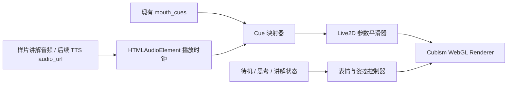

# Live2D 数字人动态样片与接入设计

## 目标

将已否决的 PNG 分层立绘方向替换为真实 Live2D 动态验证路线。第一阶段制作独立的 H5 动态样片，使用合法取得的 Live2D 试用模型验证语音、表情、眨眼、头部微动和嘴型同步是否能达到更自然的导游讲解体验；只有样片通过后，才设计微信小程序正式接入与景区专属角色制作。

## 已确认决策

- 第一版允许使用现成 Live2D 角色验证动作表现，不要求与现有蓝衣导游外观一致。
- 推荐实施路径为 `Live2D H5 动态样片 -> 样片验收 -> 小程序 web-view 接入评估`。
- 当前后端 TTS、分段播放与 `/api/tourist/voice/tts-sync` 的 `mouth_cues` 契约保持不变。
- 先不修改 `miniprogram/src/components/DigitalHuman.vue`，避免在视觉方向尚未验证时影响已有可运行页面。
- 之前的 PNG 分层样片仅保留为对照，不继续投入正式接入。

## 技术与授权边界

真实 Live2D 不能由当前 PNG 贴图直接得到。可驱动角色必须具有 Cubism 运行时模型文件，例如 `.moc3`、`.model3.json`、纹理、动作和表情配置。

样片采用 Live2D 官方 Cubism SDK for Web：

- SDK 基于 WebGL，适用于浏览器 H5 动态样片。
- Cubism Framework 与 Samples 可从官方 GitHub 获取，但 `Cubism Core` 不在 GitHub 发布，必须由用户在 Live2D 官方下载页阅读并同意协议后取得。
- 开发与技术验证可无初始 SDK 费用；应用正式发布前必须核对 SDK 发布许可。

试验模型优先采用官方 Sample Data 中的 `Epsilon FREE` 或同类 Live2D 原创角色：

- 样片用途限定为本地开发验证。
- 用户需要从官方下载页接受适用条款并下载模型，或提供已具备使用权的模型包。
- 正式小程序不默认发布该样例角色；上线前应替换为已取得商业使用许可的景区导游模型，或确认经营主体与用途满足样例模型条款。

## 第一阶段范围：H5 动态样片

### 页面结构

在独立本地预览页面中展示一个 Live2D Canvas 角色区和一组状态控制：

| 模块 | 功能 |
| --- | --- |
| Live2D 画布 | 渲染可动角色、自动呼吸与眨眼 |
| 状态切换 | 切换 `待机 / 思考 / 讲解` |
| 讲解播放 | 使用浏览器样片音频或现有短语音数据驱动口型时间轴 |
| 参数观察 | 显示当前嘴型 cue、表情状态、模型加载状态 |
| 对照说明 | 说明当前为动作验证角色，并非最终景区形象 |

页面不请求问答接口、不写入数据库、不上传 OSS，仅验证前端角色运行与口型同步表现。

### 角色行为

| 状态 | Live2D 行为 |
| --- | --- |
| 待机 | 缓慢呼吸；不规则自然眨眼；头部极轻微回中，无挑眉循环 |
| 思考 | 嘴部闭合；视线轻偏或单次轻点头；表情保持克制 |
| 开始讲解 | 进入温和欢迎表情；短暂轻抬头；嘴型随首个 cue 启动 |
| 持续讲解 | 口型连续驱动；允许自然眨眼；呼吸保持弱幅度，不抢夺注意力 |
| 停顿/结束 | 标点停顿时自然闭口；结束后平滑回到待机表情 |

### 嘴型驱动

后端现有五类嘴型 cue 不变，H5 渲染层将它们映射到 Live2D 模型参数。具体参数名依模型定义确认，标准模型优先使用 `ParamMouthOpenY` 与 `ParamMouthForm`：

| 现有 cue | 口腔开合参数 | 口型参数 |
| --- | ---: | ---: |
| `closed` | `0.00` | `0.00` |
| `small` | `0.18` | `0.10` |
| `mid` | `0.48` | `0.00` |
| `big` | `0.92` | `0.12` |
| `round` | `0.50` | `-0.75` |

渲染循环采用插值而不是硬切：目标参数变化在约 `70-110ms` 内平滑追随。若模型未提供对应口型参数，则只驱动开合参数，并在样片中标注该模型的表现限制。

### 表情与姿态

- 表情由状态驱动，不根据每一个字切换，防止脸部跳动。
- 眨眼由 Live2D 参数或模型自带动作实现，讲解期间继续允许眨眼。
- 头部角度、眼球和身体摆动只作为生命感补充，振幅保持克制。
- 眉部不做循环上抬；如果试用模型的默认动作包含夸张眉部动作，在样片加载配置中禁用该动作。

## 数据流



正式接入时，`guide.vue` 仍负责聊天和音频流程；Live2D 页面只接收音频播放进度所需的状态与 cue，或由 H5 统一执行音频播放并向小程序回报播放事件。该选择在样片验收后单独评估，以避免现在过早绑定通信方案。

## 样片资源组织

样片资源与正式源代码隔离，避免无意发布受条款约束的试验资产：

```text
.superpowers/brainstorm/live2d-prototype-20260526/
  content/
    index.html
    live2d-prototype.js
    styles.css
  vendor/
    CubismCore.js                 # 用户从官方 SDK 包取得
    framework/                    # SDK Web Framework 构建产物
  model/
    evaluation-model/             # 用户提供或官方下载的评估模型
```

样片资源目录不作为小程序发布资产提交。正式角色资源的存储位置、OSS 缓存策略与小程序域名配置，在样片验收后的接入设计中确定。

## 异常处理

- 未提供 `CubismCore.js`：页面显示“请放入官方 Cubism Core 文件”，不回退到 PNG 冒充 Live2D。
- 模型资源缺失或加载失败：显示资源加载错误及缺失文件名。
- 模型不支持预期参数：禁用缺失能力的预览按钮，并显示可驱动参数列表。
- 音频或 cue 不可用：允许手动拖动口型参数，仍可验证模型动作，不混淆为完整语音同步验收。

## 验收标准

### 动态样片

- 模型能在浏览器内稳定加载并实时渲染。
- 待机有自然眨眼和轻微呼吸，不持续挑眉。
- 思考状态不夸张、不出现面部贴片覆盖或错位。
- 讲解播放时，大开口、圆口和闭口变化清晰且连续，嘴部不硬跳。
- 状态切换过程中角色本体没有 PNG 叠层错位、白边或五官漂移。
- 用户明确确认 Live2D 方向优于当前 PNG 方案后，才进入正式小程序接入。

### 后续小程序接入门槛

- 样片动作效果获用户认可。
- 已确认最终角色模型的发布授权。
- 已确认小程序承载方式：优先评估业务域名下 H5 + `web-view`，必要时再评估原生 Canvas/WebGL。
- 现有语音播放延迟和连贯性回归测试通过。

## 不在本阶段实现

- 不将当前蓝衣 PNG 自动转换为 Live2D 模型。
- 不采购云端数字人视频流服务。
- 不将官方样例模型直接作为商业上线角色发布。
- 不修改小程序聊天、地图、路线、登录或后台管理业务。

## 官方依据

- Live2D Cubism SDK for Web 文档：https://docs.live2d.com/en/cubism-sdk-manual/cubism-sdk-for-web/
- Live2D Cubism SDK for Web 下载页：https://www.live2d.com/en/sdk/download/web/
- Live2D Sample Data 页面：https://www.live2d.com/learn/sample/
- Live2D Cubism 样例数据利用条件：https://www.live2d.com/learn/sample/model-terms/
- SDK 发布许可说明：https://www.live2d.com/sdk/license/
