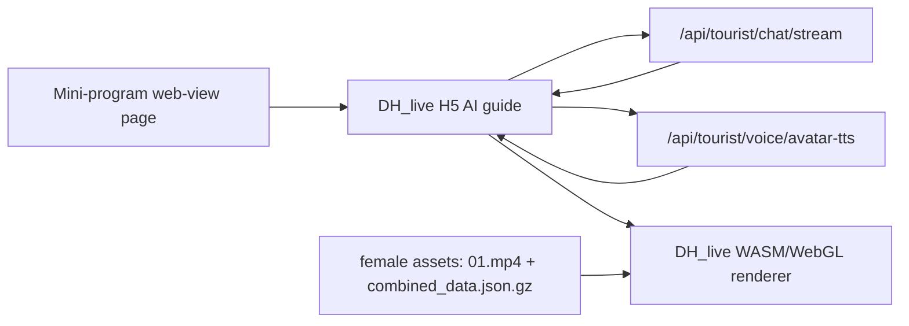

# DH_live Female Guide Avatar Mini-Program Integration Design

**Date:** 2026-05-28
**Status:** Approved by user for implementation
**Builds on:** `2026-05-26-dh-live-digital-human-integration-design.md`

## Purpose

Upgrade the DH_live proof of concept from the upstream demonstration character to the
project's new female scenic-guide assets, then expose the high-realism digital-human
experience to the WeChat mini-program through a `web-view` page.

The native PNG-based `DigitalHuman.vue` remains as the fallback. This change adds a
parallel high-realism route instead of removing the existing AI guide page.

## Confirmed Inputs

- Source still image:
  `digital_human_new/22d0cf93-5d56-4357-8a24-051f3963de4d.png`
- Neutral source video:
  `digital_human_new/万相 2.7_1779867680842.mp4`
- DH_live model files:
  `DH_live/checkpoint/`

The neutral video has been visually checked from sampled frames. It is frontal, closed
mouth, stable, and suitable for DH_live preprocessing.

## Architecture

## Implementation Scope

1. Use the DH_live preprocessing scripts to generate a female guide web asset package.
2. Replace the local H5 prototype's demonstration character assets with the generated
   female guide package.
3. Add a mini-program `web-view` page that points to a configurable DH_live H5 URL.
4. Add an entry from the current AI guide page to the high-realism digital-human page.
5. Keep the existing native AI guide, TTS sync, mouth cue, RAG, map, and route logic intact.

## Production Notes

The local H5 URL is only for development. Production release requires an HTTPS-hosted H5
page and WeChat business-domain configuration for the `web-view` target.

