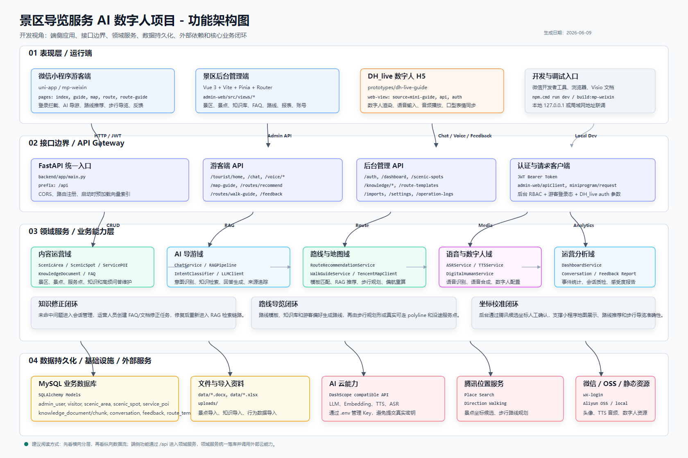
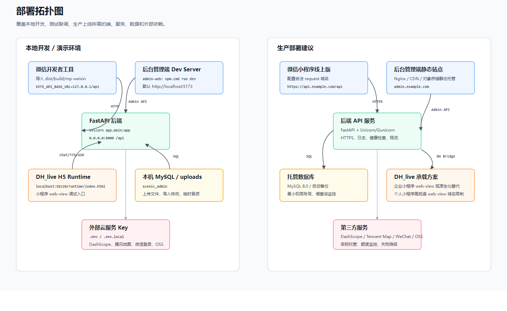
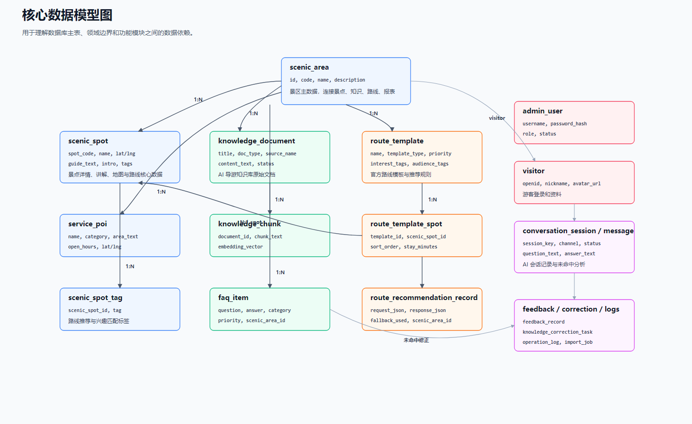
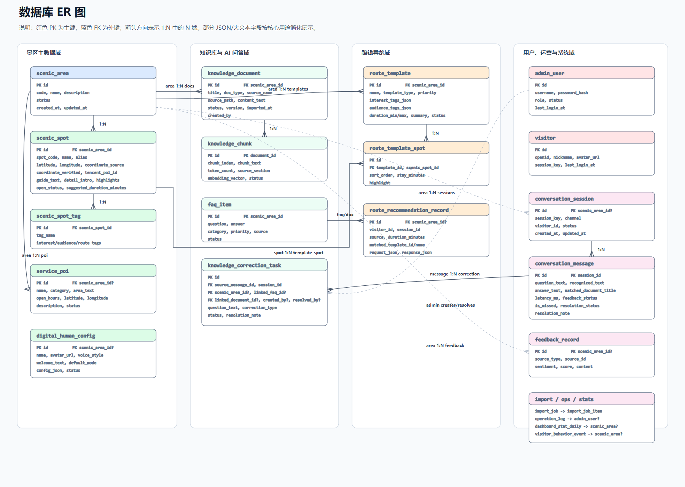
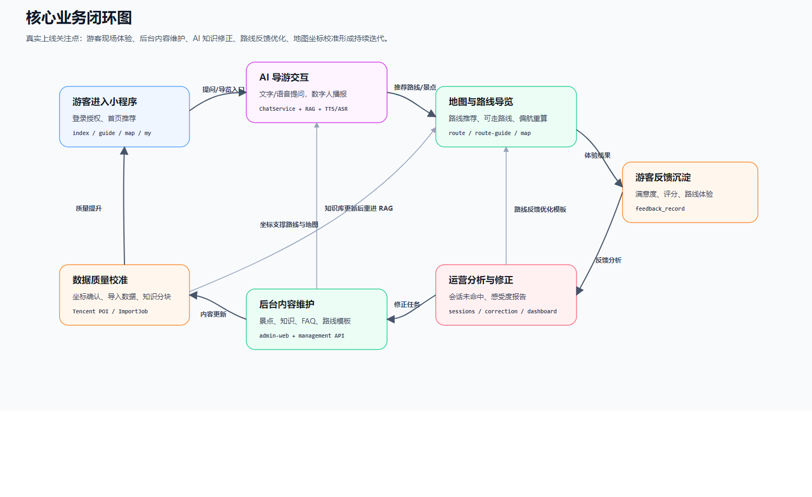

# 景区导览服务 AI 数字人项目总体设计文档

> 版本：v1.0  
> 日期：2026-06-09  
> 适用范围：当前代码仓库中的 `backend`、`admin-web`、`miniprogram`、`prototypes/dh-live-guide`、`data`、`docs`。  
> 目标读者：后端工程师、前端工程师、小程序工程师、测试人员、运维人员、产品和景区运营人员。

---

## 1. 文档现状检查

### 1.1 当前已经具备的文档

当前项目已经有较多面向需求、实施和使用的文档：

| 文档类型 | 代表文件 | 当前作用 |
| --- | --- | --- |
| 产品需求 | `景区导览服务 AI 数字人产品需求文档.md` | 描述项目目标、游客端和后台端需求 |
| 开发计划 | `景区导览服务AI数字人开发计划书.md`、`docs/superpowers/plans/*` | 记录分阶段开发计划 |
| 专项设计 | `docs/superpowers/specs/*` | 记录 RBAC、路线、知识修正、数字人、语音等专项设计 |
| 部署说明 | `本地部署手册.md`、`docs/start-frontend-backend.md` | 指导本地运行 |
| 使用说明 | `产品使用手册.md` | 指导游客端和后台端使用 |
| 架构图片 | `docs/architecture/*` | 已有功能架构图和业务流程 Visio 图 |

### 1.2 真实开发场景仍缺少的文档

如果让新的开发者、测试人员或运维人员接手项目，当前还缺少一份“总入口”式设计文档。具体缺口如下：

| 缺口 | 影响 | 本文档处理方式 |
| --- | --- | --- |
| 总体架构说明不足 | 新成员难以一次看懂端、服务、数据和第三方依赖关系 | 本文档补充分层架构、部署拓扑和模块职责 |
| 数据模型说明分散 | 开发接口或排查数据问题时需要逐个读 model | 本文档补充核心数据模型图和实体说明 |
| API 分组和业务边界缺少总览 | 前端、小程序和后端协作容易混淆接口归属 | 本文档补充游客端 API、后台 API、语音 API 和权限边界 |
| 核心业务闭环没有集中说明 | 难以理解 AI 问答、路线导览、知识修正、反馈之间的联动 | 本文档补充核心业务闭环图和关键流程 |
| 安全、密钥和上线约束缺少统一口径 | 容易出现 AppID、Key、`.env` 泄露或真机调试失败 | 本文档补充安全设计和配置边界 |
| 测试、发布和运维策略不集中 | 交付前不清楚需要验证哪些路径 | 本文档补充测试矩阵、发布检查和运维建议 |
| 风险与后续演进未统一沉淀 | 后续迭代优先级容易摇摆 | 本文档补充风险、限制和演进路线 |

本文档不替代详细 API 文档、数据库字典、上线 SOP、故障应急预案，但会给出这些文档后续应拆分的方向。

---

## 2. 项目定位与总体目标

本项目是面向景区导览场景的 AI 数字人系统，核心目标是让游客在微信小程序中获得“能问、能看、能走、能反馈”的智能导览体验，同时让景区工作人员在后台管理端维护景区内容、知识库、路线模板、数字人配置和运营数据。

系统由四个主要应用组成：

| 应用 | 路径 | 定位 |
| --- | --- | --- |
| 后端服务 | `backend/` | FastAPI 统一 API，负责认证、业务服务、数据库、AI、地图、语音和文件能力 |
| 后台管理端 | `admin-web/` | Vue 3 管理后台，用于景区运营、内容维护和系统配置 |
| 微信小程序端 | `miniprogram/` | 游客端入口，用于 AI 导游、地图、路线、步行导览、反馈和个人中心 |
| DH_live 数字人 H5 | `prototypes/dh-live-guide/` | 高拟真数字人导游展示和语音交互样片，通过小程序 web-view 接入 |

总体设计原则：

- 后端统一提供 `/api` 接口，不让小程序直接持有敏感 Key。
- 游客端强调现场体验，后台端强调数据维护和运营闭环。
- AI 问答以 RAG 知识库为主，FAQ 和知识修正作为可运营闭环。
- 路线推荐既参考路线模板，也结合游客偏好和知识库做灵活推荐。
- 地图和步行导览以数据库坐标为基础，腾讯位置服务作为校准和规划增强。
- DH_live 方案保留为当前最佳数字人效果方案，后续上线时根据小程序资质选择承载策略。

---

## 3. 需求分析

本章基于 `景区导览服务 AI 数字人产品需求文档.md` 提炼总体设计需要承接的需求边界。详细页面原型、字段和验收细则仍以 PRD、产品使用手册和专项设计为准，本文档重点说明系统设计必须满足的业务目标、用户场景、功能范围和质量约束。

### 3.1 需求来源与设计输入

| 来源 | 关键内容 | 对总体设计的影响 |
| --- | --- | --- |
| 赛题要求 | 多模态大模型、本地景区知识库、事实问答准确率、语音问答延迟、数字人口型和表情自然度 | 系统必须具备 AI、RAG、ASR、TTS、数字人和可演示闭环 |
| 景区业务场景 | 游客现场导览、景点讲解、路线推荐、服务点查询、反馈收集 | 小程序端必须围绕现场高频任务组织页面，而不是只做聊天入口 |
| 运营管理需求 | 景点、路线、知识、FAQ、数字人配置、会话修正、数据报告 | 后台管理端必须能持续维护内容，并把游客反馈转成改进动作 |
| 当前代码实现 | 已有 FastAPI、Vue 后台、uni-app 小程序、DH_live H5、腾讯地图、DashScope 能力 | 总体设计要尊重现有技术栈，优先补齐闭环和上线边界 |
| 上线限制 | 个人小程序 web-view 域名限制、真机网络、第三方 Key 和费用 | 设计中需要保留 DH_live 最佳效果方案，同时提供小程序原生兜底能力 |

### 3.2 用户角色与核心诉求

| 角色 | 使用场景 | 核心诉求 |
| --- | --- | --- |
| 普通游客 | 到达景区后使用小程序查询景点、路线和服务点 | 少操作、快响应、回答可信、路线能走 |
| 亲子游客 / 老年游客 / 首次来访游客 | 不熟悉景区，需要低门槛讲解和路线安排 | 语言易懂、路线强度合适、导览提示明确 |
| 时间有限游客 | 只有 1 小时、半天或一天可游览 | 自动筛出精华景点，避免路线绕路或时间超限 |
| 景区内容管理员 | 维护景点资料、讲解词、FAQ 和知识文档 | 内容可维护、问题可修正、知识来源可追溯 |
| 景区运营管理员 | 关注游客满意度、热门问题、路线使用效果 | 有数据看板、反馈归因、运营建议和优化入口 |
| 系统管理员 | 管理后台账号、AI 配置、接口密钥和运行状态 | 权限清晰、配置安全、问题可审计 |

### 3.3 游客端核心需求

| 模块 | 核心需求 | 设计落点 |
| --- | --- | --- |
| 首页 | 展示景区入口、热门景点、常问问题、快捷功能；未登录时先弹窗引导登录 | `pages/index/index`、游客登录状态、首页聚合 API |
| AI 导游 | 支持文本和语音提问，结合知识库回答，并驱动数字人播报 | `pages/guide/guide`、DH_live、原生语音兜底、游客问答 API |
| 景点详情 | 展示景点简介、讲解、开放状态、图片、标签和加入路线能力 | 景点详情页、景点知识和坐标主数据 |
| 个性化路线推荐 | 根据兴趣、时长、人群、节奏、起终点生成可解释路线 | 路线推荐服务、路线模板、知识增强、推荐记录 |
| 步行导览 | 在独立页面展示真实可走路线、当前位置、下一站、剩余时间和偏航重算 | `pages/route-guide/route-guide`、腾讯步行规划、polyline helper |
| 地图浏览 | 查看景点、服务点和当前位置，不承载复杂路线进度 | `pages/map/map`、地图导览 API、坐标校准数据 |
| 便民服务 | 查询厕所、餐饮、游客中心等服务点，并能在地图定位 | `service_poi`、服务点页面和地图联动 |
| 游客反馈 | 对问答、路线、景点和整体体验提交评分与文本反馈 | 反馈 API、感受度报告、知识修正入口 |

### 3.4 后台管理端核心需求

| 模块 | 核心需求 | 设计落点 |
| --- | --- | --- |
| 登录与权限 | 管理员登录、角色区分、菜单和接口权限控制 | JWT、RBAC、`admin_user`、路由守卫 |
| 工作台 | 汇总事件、景点、知识、热门问题、行为趋势 | `dashboard_stat_daily`、运营聚合 API |
| 景区与景点管理 | 维护景区、景点资料、标签、讲解词、图片和坐标 | `scenic_area`、`scenic_spot`、腾讯坐标校准 |
| 服务点管理 | 维护厕所、餐饮、停车、游客中心等 POI | `service_poi`、地图端服务点展示 |
| 路线模板管理 | 维护官方路线、站点顺序、停留时间和规则说明 | `route_template`、`route_template_spot` |
| 知识库管理 | 上传文档、查看分块、重建向量、管理 FAQ | `knowledge_document`、`knowledge_chunk`、`faq_item` |
| 会话与知识修正 | 查看问答记录、标记错误、生成修正任务并闭环处理 | `conversation_message`、`knowledge_correction_task` |
| 数字人配置 | 维护欢迎语、音色、模式、头像和 DH_live 参数 | `digital_human_config`、数字人配置 API |
| 感受度报告 | 分析满意度、差评原因、热门景点和路线反馈 | `feedback_record`、行为事件、AI 运营建议 |
| 系统配置与日志 | 管理 AI 服务商、操作日志和导入任务 | `ai_provider_config`、`operation_log`、`import_job` |

### 3.5 AI 与数字人需求

| 能力 | 需求说明 | 设计约束 |
| --- | --- | --- |
| 多模态大模型 | 至少接入一个大模型能力，支撑问答、意图识别、路线文案和运营分析 | 后端统一封装模型客户端，不在前端暴露 Key |
| RAG 知识库 | 基于景区资料建立本地知识库，回答必须尽量引用可追溯内容 | 文档导入、分块、向量化、召回和未命中记录形成闭环 |
| ASR 语音识别 | 游客可使用语音提问，识别结果应回显或进入确认链路 | 小程序原生录音和 DH_live web-view 受限场景都要考虑 |
| TTS 语音合成 | AI 回答可转成语音播报，并尽量降低等待时间 | 音频文件由后端生成或代理，前端只播放结果 |
| 数字人驱动 | 数字人应具备欢迎、讲解、问答播报和基础表情口型表现 | 保留 DH_live 作为高拟真方案，不随意改动其核心承载方式 |
| 情感与反馈分析 | 对游客反馈做情绪倾向和主题归因，生成运营建议 | 结果进入感受度报告，不直接替代人工运营判断 |

### 3.6 非功能需求

| 类型 | 要求 | 设计响应 |
| --- | --- | --- |
| 性能 | 普通 API 应快速响应；AI、语音、地图接口需要可观测耗时 | 增加日志、超时、fallback 和必要缓存 |
| 准确性 | 景区事实问答要基于知识库，路线和地图坐标要可信 | RAG 来源追溯、知识修正、坐标校准、腾讯地图增强 |
| 稳定性 | 网络波动、第三方接口失败、定位失败时不能白屏或崩溃 | 统一错误处理、降级提示、直线导览 fallback |
| 易用性 | 游客端减少学习成本，后台端适合重复录入和运营 | 小程序功能分页面承载，后台使用表格、表单和筛选 |
| 安全性 | 密钥不能进入仓库或小程序端，游客和后台权限隔离 | `.env`、服务端代理、JWT、RBAC、操作日志 |
| 可维护性 | 新景区、新知识、新路线应可配置，不依赖改代码 | 景区主数据、知识库、路线模板和数字人配置全部后台化 |

### 3.7 优先级基线

| 优先级 | 需求范围 | 判断标准 |
| --- | --- | --- |
| P0 必须上线 | 首页、AI 导游、知识问答、路线推荐、反馈、后台登录、知识库、景点管理、数字人基础配置 | 没有这些能力，系统无法完成主演示链路 |
| P1 建议上线 | 地图导览、步行导览、路线模板、会话修正、感受度报告、服务点管理、数据导入 | 这些能力决定产品是否像真实景区系统 |
| P2 可选增强 | 多数字人角色、更多情绪动作、精细化运营建议、跨景区复用、外部导航增强 | 适合作为冲奖或产品化迭代 |

### 3.8 总体验收主线

系统验收应至少覆盖以下完整链路：

1. 游客进入小程序，未登录时看到温和登录提示，登录后进入功能。
2. 游客进入 AI 导游页，通过文本或语音提问景点历史，数字人给出可信回答。
3. 游客选择兴趣、时长、人群和起终点，系统生成个性化路线。
4. 游客点击开始步行导览，进入独立导览页，看到真实路线、下一站和服务点。
5. 游客在问答或路线结束后提交反馈。
6. 后台管理员查看会话、反馈、热门问题和感受度报告。
7. 内容管理员把错误回答转成知识修正，更新 FAQ 或知识文档。
8. 后台修改景点、路线、服务点或数字人配置后，小程序端能体现最新数据。

---

## 4. 项目解决的痛点与核心优势

本项目不是单纯把聊天机器人放进景区小程序，而是围绕“游客现场导览”和“景区持续运营”两个真实场景，解决传统导览工具交互弱、内容难维护、路线不灵活、运营数据断层等问题。

### 4.1 主要痛点

| 痛点 | 典型表现 | 项目解决方式 |
| --- | --- | --- |
| 传统导览缺少实时互动 | 录音讲解只能单向播放，游客临时问题无法得到回答 | 通过 AI 导游、RAG 知识库、FAQ 和多轮会话支持实时问答 |
| 人工导游资源有限 | 高峰期讲解供给不足，低峰期人力成本高 | 数字人导游 7x24 小时在线，承担高频、标准化讲解和咨询 |
| 景区知识分散且更新困难 | 景点资料、讲解词、FAQ、路线说明分散在文档或人员经验中 | 后台统一维护景点、知识文档、FAQ、路线模板和数字人配置 |
| 路线推荐不够个性化 | 官方路线固定，无法兼顾兴趣、时长、人群、体力和起终点 | 路线推荐结合模板、标签、游客偏好、起终点和步行导览能力 |
| 地图和坐标错误影响体验 | 景点位置靠人工录入，容易经纬度反转或位置偏移 | 后台引入腾讯地图坐标校准，保存坐标来源和确认状态 |
| 游客反馈难以形成闭环 | 满意度、差评原因和未命中问题难以回流到内容维护 | 会话记录、反馈记录、知识修正任务和感受度报告形成运营闭环 |
| 小程序现场网络与权限复杂 | 真机访问、本地地址、麦克风、定位和 web-view 限制容易造成不可用 | 设计登录、语音、定位、DH_live 和原生兜底的边界与降级方案 |
| 后台容易流于展示 | 只做数据列表，无法真正改善游客端体验 | 后台修改内容、坐标、知识、路线和数字人配置后可影响小程序端 |

### 4.2 面向游客的核心优势

| 优势 | 说明 |
| --- | --- |
| 问得清楚 | 游客可以用文字或语音询问景点历史、开放状态、路线建议和服务点信息 |
| 答得可信 | 回答基于本地景区知识库和 FAQ，避免纯大模型自由发挥 |
| 看得直观 | 景点、服务点、当前位置和路线通过小程序地图展示 |
| 走得明白 | 路线推荐后进入独立步行导览页，展示下一站、剩余距离、预计时间和偏航提示 |
| 体验更自然 | DH_live 保留为高拟真数字人方案，提升语音讲解和情感互动表现 |
| 操作负担低 | 首页、AI 导游、地图、路线和反馈分页面承载，避免把所有功能堆在一个页面 |

### 4.3 面向景区运营的核心优势

| 优势 | 说明 |
| --- | --- |
| 内容可运营 | 景点、服务点、知识文档、FAQ、路线模板和数字人配置都可以在后台维护 |
| 问题可追踪 | 每轮问答可记录问题、识别文本、回答、命中文档、耗时和反馈状态 |
| 错误可修正 | 未命中或低质量回答可转入知识修正任务，再回流到 FAQ 或知识库 |
| 路线可迭代 | 运营人员可以维护官方模板，同时用反馈和推荐记录优化路线策略 |
| 数据可分析 | 工作台、数据大屏和感受度报告能展示热门景点、热门问题、路线使用和满意度 |
| 配置更安全 | 第三方 Key、AppSecret、数据库密码等敏感信息留在后端或环境变量，不暴露给小程序 |

### 4.4 面向开发和上线的核心优势

| 优势 | 说明 |
| --- | --- |
| 架构边界清晰 | `backend`、`admin-web`、`miniprogram`、`prototypes/dh-live-guide` 分工明确 |
| 第三方能力后端代理 | 腾讯地图、DashScope、微信登录等能力由后端统一封装，便于限流、日志和密钥保护 |
| 支持降级可用 | 地图规划失败、定位失败、语音不可用、web-view 受限时都有可控 fallback 方向 |
| 数据模型可扩展 | 以景区、景点、知识、路线、会话、反馈为核心实体，支持后续多景区扩展 |
| 文档链路完整 | PRD、部署手册、产品使用手册、总体设计、架构图、数据库 ER 图互相补位 |

---

## 5. 总体功能架构



上图按真实开发协作视角分为四层：

1. 表现层 / 运行端：微信小程序、后台管理端、DH_live H5、开发调试入口。
2. 接口边界 / API Gateway：FastAPI 统一入口、游客 API、后台 API、认证和请求客户端。
3. 领域服务 / 业务能力层：内容运营、AI 导游、路线地图、语音数字人、运营分析。
4. 数据持久化 / 基础设施 / 外部服务：MySQL、导入资料、DashScope、腾讯地图、微信登录、OSS/静态资源。

### 5.1 表现层

#### 微信小程序游客端

路径：`miniprogram/`

主要页面：

| 页面 | 说明 |
| --- | --- |
| `pages/index/index` | 首页、快捷入口、常问问题、热门景点 |
| `pages/guide/guide` | AI 导游页，承载 DH_live web-view |
| `pages/voice-capture/voice-capture` | 原生语音输入兜底页 |
| `pages/map/map` | 地图导览、景点和服务点定位 |
| `pages/spot/spot` | 景点讲解详情 |
| `pages/route/route` | 个性化路线推荐 |
| `pages/route-guide/route-guide` | 独立步行导览 |
| `pages/services/services` | 便民服务点查询 |
| `pages/feedback/feedback` | 游客反馈 |
| `pages/my/my` | 登录、资料、反馈、对话历史 |

小程序的开发重点是端侧状态、登录边界、地图定位、语音权限、web-view 限制和真机网络地址。

#### 景区后台管理端

路径：`admin-web/`

主要菜单：

| 菜单 | 对应职责 |
| --- | --- |
| 工作台 | 总事件量、景点数量、知识文档、热门景点、行为趋势 |
| 景区管理 | 景区主数据 |
| 景点管理 | 景点资料、讲解、标签、坐标校准 |
| 便民服务点 | 厕所、餐饮、停车、游客服务中心等 |
| 路线模板 | 官方路线模板、站点顺序、推荐预览 |
| 知识管理 | AI 知识文档和知识分块 |
| 知识修正任务 | 未命中问题修正闭环 |
| FAQ 管理 | 高频问答 |
| 会话管理 | 游客会话、未命中问题、修复标记 |
| 数据导入 | 景点、知识、行为数据导入 |
| 感受度报告 | 满意度、差评归因、路线反馈分析 |
| 数字人配置 | 数字人欢迎语、音色、模式和配置 |
| AI 配置 | 模型提供商配置 |
| 账号管理 | 管理员账号、角色、状态 |
| 操作日志 | 后台操作审计 |

#### DH_live 数字人 H5

路径：`prototypes/dh-live-guide/`

当前定位是小程序 AI 导游页的高拟真数字人承载方案。它通过 URL 参数接收：

- `source=mini-guide`
- `api=<API_BASE_URL>`
- `auth=<游客 token>`
- `question=<首页或景点页带入的问题>`
- `auto=1`

DH_live H5 主要调用后端 AI 问答、TTS、ASR 和反馈接口。正式上线时需要重点处理小程序 web-view 域名资质限制。

---

## 6. 部署拓扑设计



### 6.1 本地开发环境

本地开发建议采用四进程并行：

| 进程 | 默认地址 | 说明 |
| --- | --- | --- |
| 后端 FastAPI | `http://127.0.0.1:8000/api` | `uvicorn app.main:app --host 0.0.0.0 --port 8000` |
| 后台管理端 | `http://localhost:5173` | `admin-web` 执行 `npm.cmd run dev` |
| 小程序构建 | `miniprogram/dist/build/mp-weixin` | 由微信开发者工具导入 |
| DH_live Runtime | `http://localhost:58120/runtime/index.html` | 静态服务承载 |

本地模拟器可以访问 `127.0.0.1`，但真机测试不能使用 `127.0.0.1`，必须改为电脑局域网 IP 或 HTTPS 域名。

### 6.2 生产部署建议

生产环境建议采用：

- 后端 API：独立服务器或云服务部署 FastAPI，统一 HTTPS 域名。
- 后台管理端：静态构建后部署到 Nginx、CDN 或对象存储静态站点。
- 小程序：配置合法 request 域名，后端 Key 全部留在服务端。
- MySQL：使用托管数据库或独立 MySQL，开启备份和最小权限账号。
- DH_live：企业小程序可走 web-view 业务域名；个人小程序需选择原生化替代、云端视频流或其他合规承载方案。
- 外部服务：DashScope、腾讯位置服务、微信登录、OSS Key 全部用环境变量或密钥管理服务托管。

---

## 7. 后端总体设计

### 7.1 后端分层

后端采用 FastAPI + SQLAlchemy 的典型分层：

| 层级 | 路径 | 职责 |
| --- | --- | --- |
| API Router | `backend/app/api/routers/` | HTTP 路由、鉴权依赖、请求响应转换 |
| Schema | `backend/app/schemas/` | Pydantic 请求和响应模型 |
| Service | `backend/app/services/` | 业务规则、第三方服务编排 |
| Repository | `backend/app/repositories/` | 数据访问封装 |
| Model | `backend/app/models/` | SQLAlchemy ORM 模型 |
| Importer / Task | `backend/app/importers/`、`backend/app/tasks/` | 文件导入、知识分块、向量生成、统计任务 |
| Utils | `backend/app/utils/` | 文件存储、对象存储、文本清洗 |

### 7.2 主要后端路由

| API 分组 | 路径前缀 | 用途 |
| --- | --- | --- |
| 健康检查 | `/api/health` | 服务存活检查 |
| 后台认证 | `/api/auth` | 管理员登录、当前用户 |
| 景区管理 | `/api/scenic-areas` | 景区 CRUD |
| 景点管理 | `/api/scenic-spots` | 景点 CRUD、腾讯坐标候选、坐标确认 |
| 便民服务点 | `/api/service-pois` | 服务点 CRUD |
| 路线模板 | `/api/route-templates` | 路线模板和站点管理 |
| 后台路线预览 | `/api/route-recommendations/generate` | 后台推荐预览 |
| 知识文档 | `/api/knowledge/documents` | 文档上传、列表、详情、分块 |
| FAQ | `/api/knowledge/faqs` | FAQ CRUD |
| 知识修正 | `/api/knowledge/correction-tasks` | 修正任务跟踪 |
| 会话 | `/api/sessions` | 会话、未命中、标记修复 |
| 导入 | `/api/imports` | 景点、知识、行为数据导入 |
| 数据大屏 | `/api/dashboard` | 工作台、趋势、反馈报告 |
| 数字人 | `/api/digital-humans` | 数字人配置 |
| 设置 | `/api/settings` | AI 提供商、管理员账号 |
| 操作日志 | `/api/operation-logs` | 写操作审计 |
| 游客端 | `/api/tourist/*` | 首页、登录、资料、问答、地图、路线、反馈 |
| 游客语音 | `/api/tourist/voice/*` | TTS、ASR、音频文件 |

### 7.3 配置项

后端配置集中在 `backend/app/core/config.py`，核心配置如下：

| 配置 | 说明 |
| --- | --- |
| `DATABASE_URL` | MySQL 连接 |
| `JWT_SECRET_KEY` | JWT 签名密钥 |
| `DASHSCOPE_API_KEY` | LLM、Embedding、TTS、ASR 所需 Key |
| `LLM_MODEL` / `LLM_BASE_URL` | 大模型配置 |
| `RAG_TOP_K` / `RAG_SCORE_THRESHOLD` | RAG 检索参数 |
| `WECHAT_APPID` / `WECHAT_SECRET` | 微信登录 |
| `TENCENT_MAP_KEY` | 腾讯位置服务 |
| `ALIYUN_OSS_*` | 头像、音频、静态资源对象存储 |

真实开发要求：

- 不提交真实 `.env`。
- 不把小程序 AppSecret、腾讯地图 Key、DashScope Key 写入前端。
- GitHub 仓库中 AppID、Key、Secret 使用占位符。
- 生产环境使用密钥管理或服务器环境变量。

---

## 8. 前端与小程序设计

### 8.1 后台管理端设计

后台管理端采用 Vue 3 + Router + Pinia + Axios + Element Plus。整体设计目标是面向运营人员的后台工具，不做营销式首页，重点是信息密度、表单效率和数据可维护性。

核心机制：

- `stores/auth.ts` 保存后台 token、用户名和角色。
- `router/index.ts` 根据角色控制可访问页面。
- `api/client.ts` 统一追加 Bearer Token。
- 页面以业务域划分：景区、景点、服务点、路线、知识、FAQ、会话、导入、报表、配置。

### 8.2 小程序端设计

小程序端采用 uni-app + Vue + Pinia。核心能力：

- 首页统一承接景区信息、热门景点和快捷入口。
- `utils/authGuard.ts` 负责非登录状态提示和跳转。
- `stores/auth.ts` 管理游客 token 和资料。
- `api/tourist.ts` 封装游客端 API。
- `pages/guide/guide.vue` 用 web-view 加载 DH_live。
- `pages/route-guide/route-guide.vue` 独立承载步行导览，不把导览进度堆在通用地图页。

小程序端需要重点验证：

- 微信开发者工具模拟器网络。
- 真机局域网 IP 或 HTTPS 域名。
- 麦克风、定位、头像选择授权。
- 地图 marker 坐标合法性。
- web-view 域名和个人小程序限制。

---

## 9. 数据模型设计



### 9.1 景区与内容数据

| 实体 | 说明 |
| --- | --- |
| `scenic_area` | 景区主数据 |
| `scenic_spot` | 景点资料、讲解、坐标、开放状态 |
| `scenic_spot_tag` | 景点标签，用于路线和兴趣匹配 |
| `service_poi` | 便民服务点 |
| `digital_human_config` | 数字人配置 |

这些数据直接影响小程序首页、地图、景点详情、路线推荐和步行导览。

### 9.2 知识与问答数据

| 实体 | 说明 |
| --- | --- |
| `knowledge_document` | 知识库原始文档 |
| `knowledge_chunk` | 文档分块与向量 |
| `faq_item` | 高频问答 |
| `knowledge_correction_task` | 知识修正任务 |

知识数据是 AI 导游回答质量的核心。新增或修改文档后，需要重新分块和向量化，并通过典型问题回归测试。

### 9.3 路线与导览数据

| 实体 | 说明 |
| --- | --- |
| `route_template` | 路线模板 |
| `route_template_spot` | 模板站点 |
| `route_recommendation_record` | 推荐请求与结果记录 |

路线推荐以模板为稳定基线，以游客偏好和知识库内容作为增强。步行导览依赖景点坐标和腾讯步行规划。

### 9.4 会话与反馈数据

| 实体 | 说明 |
| --- | --- |
| `visitor` | 游客账号 |
| `conversation_session` | 会话 |
| `conversation_message` / `conversation_turn` | 问答消息和轮次 |
| `feedback_record` | 游客反馈 |
| `visitor_behavior_event` | 游客行为事件 |
| `dashboard_stat_daily` | 日统计数据 |

这部分数据构成运营分析、会话质检、知识修正和感受度报告的数据基础。

---

## 10. 数据库设计

数据库采用 MySQL 作为主库，后端通过 SQLAlchemy ORM 管理模型。业务表普遍继承 `TimestampMixin`，保留 `created_at`、`updated_at`，方便后台审计、问题排查和后续数据同步。



### 10.1 设计约定

| 约定 | 说明 |
| --- | --- |
| 主键 | 核心业务表统一使用自增 `id`，便于后台管理和关联查询 |
| 外键 | 字段名使用 `*_id`，优先关联主业务实体，如 `scenic_area_id`、`session_id`、`document_id` |
| 状态字段 | 使用 `status`、`open_status`、`feedback_status`、`resolution_status` 等表达业务生命周期 |
| JSON 字段 | 用于保存灵活配置、请求快照、响应快照和统计结果，如 `config_json`、`request_json`、`response_json` |
| 坐标字段 | 景点和服务点统一使用 `latitude`、`longitude`，小程序地图侧按 GCJ-02 坐标使用 |
| 时间字段 | 除特殊业务时间外，表级创建和更新时间统一由 `created_at`、`updated_at` 承担 |

### 10.2 景区主数据表

| 表名 | 主要字段 | 说明 |
| --- | --- | --- |
| `scenic_area` | `id`、`code`、`name`、`description`、`status` | 景区主档案，是景点、路线、知识库和运营数据的归属入口 |
| `scenic_spot` | `scenic_area_id`、`spot_code`、`name`、`alias`、`latitude`、`longitude`、`coordinate_source`、`coordinate_confidence`、`coordinate_verified`、`guide_text`、`detail_intro`、`suggested_duration_minutes`、`open_status` | 景点核心资料，支撑首页推荐、地图标记、详情讲解、路线推荐和步行导览 |
| `scenic_spot_tag` | `scenic_spot_id`、`tag_name` | 景点标签，用于兴趣筛选、路线匹配和后台内容组织 |
| `service_poi` | `scenic_area_id`、`name`、`category`、`area_text`、`latitude`、`longitude`、`open_hours`、`status` | 厕所、餐饮、游客中心等服务点，支撑地图查询和沿途服务推荐 |
| `digital_human_config` | `scenic_area_id`、`name`、`avatar_url`、`voice_style`、`welcome_text`、`default_mode`、`config_json`、`status` | 数字人展示和播报配置，保留可扩展 JSON 以兼容 DH_live 方案 |

### 10.3 知识库与问答表

| 表名 | 主要字段 | 说明 |
| --- | --- | --- |
| `knowledge_document` | `scenic_area_id`、`title`、`doc_type`、`source_path`、`source_name`、`content_text`、`status`、`version`、`imported_at`、`created_by` | 知识库原始文档，保存导入来源、全文内容和版本信息 |
| `knowledge_chunk` | `document_id`、`chunk_index`、`chunk_text`、`token_count`、`source_section`、`embedding_vector`、`status` | RAG 检索分块，后续可迁移到向量数据库或独立检索服务 |
| `faq_item` | `scenic_area_id`、`question`、`answer`、`category`、`priority`、`status`、`source` | 高频问答，适合沉淀稳定、短路径命中的游客问题 |
| `knowledge_correction_task` | `source_message_id`、`session_id`、`scenic_area_id`、`question_text`、`recognized_text`、`feedback_status`、`correction_type`、`status`、`linked_faq_id`、`linked_document_id`、`created_by`、`resolved_by` | 知识修正工单，把游客反馈、未命中问题和后台修正动作串联起来 |

### 10.4 路线导览表

| 表名 | 主要字段 | 说明 |
| --- | --- | --- |
| `route_template` | `scenic_area_id`、`name`、`template_type`、`interest_tags_json`、`audience_tags_json`、`duration_min_minutes`、`duration_max_minutes`、`summary`、`status`、`priority`、`rule_notes` | 官方或运营维护的路线模板，是推荐路线的稳定基线 |
| `route_template_spot` | `template_id`、`scenic_spot_id`、`sort_order`、`stay_minutes`、`highlight` | 路线模板与景点的中间表，记录游览顺序、停留时间和站点重点 |
| `route_recommendation_record` | `scenic_area_id`、`visitor_id`、`session_id`、`source`、`duration_minutes`、`matched_template_id`、`matched_template_name`、`fallback_used`、`request_json`、`response_json` | 推荐请求和结果快照，用于复盘推荐质量、统计路线使用和排查异常 |

### 10.5 用户、会话与反馈表

| 表名 | 主要字段 | 说明 |
| --- | --- | --- |
| `visitor` | `openid`、`nickname`、`avatar_url`、`session_key`、`last_login_at` | 微信游客身份表，支撑登录态、个性化和行为归因 |
| `conversation_session` | `scenic_area_id`、`session_key`、`channel`、`visitor_id`、`status` | 一次游客问答或数字人交互会话 |
| `conversation_message` | `session_id`、`question_text`、`recognized_text`、`answer_text`、`matched_document_title`、`latency_ms`、`feedback_status`、`is_missed`、`resolution_status`、`resolution_note` | 单条问答消息，承载命中情况、回答质量、延迟和反馈状态 |
| `conversation_turn` | `session_id`、`role`、`content`、`intent`、`tokens_used` | 多轮对话明细，便于保留上下文和后续分析模型消耗 |
| `feedback_record` | `scenic_area_id`、`source_type`、`source_id`、`sentiment`、`score`、`content` | 通用反馈表，可挂接问答、路线、景点或其它业务对象 |

### 10.6 后台、导入与运营表

| 表名 | 主要字段 | 说明 |
| --- | --- | --- |
| `admin_user` | `username`、`password_hash`、`role`、`status`、`last_login_at` | 后台管理员账号，负责后台登录、权限区分和操作归属 |
| `ai_provider_config` | `provider_name`、`model_type`、`endpoint`、`api_key_masked`、`extra_config_json`、`status` | AI 服务商配置，只保存脱敏展示值，真实密钥应来自环境变量或密钥管理 |
| `import_job` | `job_type`、`source_file_name`、`source_file_path`、`status`、`total_count`、`success_count`、`failed_count`、`error_message`、`started_at`、`finished_at`、`created_by` | 数据导入批次表，记录导入任务整体状态 |
| `import_job_item` | `import_job_id`、`item_type`、`raw_payload_json`、`target_type`、`target_id`、`status`、`error_message` | 导入明细表，记录每条源数据的处理结果和失败原因 |
| `operation_log` | `admin_user_id`、`module`、`action`、`target_type`、`target_id`、`detail_json` | 后台操作日志，支撑审计、追责和问题复盘 |
| `dashboard_stat_daily` | `stat_date`、`scenic_area_id`、`total_visitors`、`total_events`、`hot_spot_top_json`、`hot_question_top_json`、`route_usage_json`、`satisfaction_score` | 每日运营统计快照，减少后台首页实时聚合压力 |
| `visitor_behavior_event` | `scenic_area_id`、`event_time`、`visitor_id`、`session_id`、`event_type`、`event_value`、`spot_name`、`route_name`、`raw_json` | 游客行为事件明细，是热力分析、路线使用和转化统计的数据来源 |

### 10.7 核心关系说明

| 关系 | 说明 |
| --- | --- |
| `scenic_area` 1:N `scenic_spot`、`service_poi`、`knowledge_document`、`faq_item`、`route_template` | 景区是后台内容和游客端数据的主边界 |
| `scenic_spot` 1:N `scenic_spot_tag`，N:M `route_template` | 景点既可被标签检索，也可被多个路线模板复用 |
| `knowledge_document` 1:N `knowledge_chunk` | 文档导入后被拆成多个可检索片段 |
| `route_template` 1:N `route_template_spot` | 路线模板通过中间表维护站点顺序和停留时间 |
| `conversation_session` 1:N `conversation_message`、`conversation_turn` | 会话维度串联多轮问答和消息反馈 |
| `conversation_message` 1:N `knowledge_correction_task` | 低质量回答、未命中问题可以转化为知识修正任务 |
| `admin_user` 1:N `import_job`、`operation_log`、`knowledge_correction_task` | 后台人员导入、操作和修正动作需要可追溯 |

### 10.8 数据库设计注意事项

- `route_recommendation_record.visitor_id`、`session_id` 和部分行为事件字段目前偏向业务快照，适合快速落地，但生产环境建议逐步补强外键或建立一致的 ID 映射规则。
- `request_json`、`response_json`、`raw_json` 等 JSON 字段便于保留上下文，但需要在 API 文档中固定结构版本，避免后续统计口径漂移。
- 坐标字段需要和 `coordinate_source`、`coordinate_verified` 一起使用。地图、路线和导览异常排查时，应优先检查坐标来源、坐标系和是否已校准。
- 正式上线前建议从本文档拆分出 `docs/database-dictionary.md`，补充字段类型、长度、默认值、索引、唯一约束和迁移记录。
- 涉及密钥的表只保存脱敏值或配置标识，真实 `TENCENT_MAP_KEY`、AI Key、数据库密码必须放在环境变量或密钥管理系统中。

---

## 11. 核心业务闭环



### 11.1 AI 导游问答闭环

1. 游客在小程序或 DH_live 中提问。
2. 小程序携带游客 token 调用 `/api/tourist/chat` 或流式接口。
3. 后端进行意图识别、RAG 检索、FAQ/知识文档匹配。
4. LLM 生成回答，必要时 TTS 合成语音。
5. DH_live 播放回答并驱动口型表情。
6. 如果回答不准确，游客反馈或后台会话管理沉淀未命中。
7. 运营人员通过 FAQ 或知识文档修正，再回到 RAG 链路。

### 11.2 路线推荐与步行导览闭环

1. 游客选择兴趣、时长、人群、节奏、起终点和服务需求。
2. 小程序调用 `/api/tourist/routes/recommend`。
3. 后端结合路线模板、景点标签、知识库和用户偏好生成路线。
4. 游客点击“开始步行导览”，调用 `/api/tourist/routes/walk-guide`。
5. 后端解析景点坐标，逐段调用腾讯步行规划。
6. 小程序展示 polyline、下一站、到达/跳过、沿途服务点。
7. 偏航后提示从当前位置重算。
8. 游客反馈进入感受度报告，运营人员优化模板和数据。

### 11.3 景点坐标校准闭环

1. 内容管理员在后台新增或编辑景点。
2. 点击“腾讯坐标”或“批量扫描待校准”。
3. 后端调用腾讯 POI/地理编码能力返回候选点。
4. 管理员人工确认候选坐标。
5. 坐标写回 `scenic_spot`。
6. 小程序地图、路线推荐、步行导览使用校准后的坐标。

### 11.4 数据导入与运营分析闭环

1. 管理员上传景点、知识或行为数据文件。
2. 后端创建 `import_job` 并记录每条导入明细。
3. 数据写入景点、知识文档、行为事件等表。
4. 工作台和感受度报告聚合展示趋势、热门景点、差评原因。
5. 运营人员根据报表优化知识、路线、景点和服务点。

---

## 12. AI、RAG、语音和数字人设计

### 12.1 RAG 问答链路

RAG 链路由以下模块组成：

| 模块 | 说明 |
| --- | --- |
| `KnowledgeService` | 维护知识文档和分块 |
| `knowledge_chunker` | 将文档切成可检索分块 |
| `EmbeddingService` | 生成向量 |
| `VectorStore` | FAISS 向量索引 |
| `RAGPipeline` | 召回上下文并组织提示词 |
| `LLMClient` | 调用 DashScope 兼容接口 |
| `ChatService` | 会话、意图、回答、来源整合 |

关键设计要求：

- 回答需要尽量引用知识来源。
- 未命中或低置信问题要进入会话管理。
- 知识文档更新后需要重新分块和向量化。
- 生产环境应记录回答耗时、召回分数、命中文档和错误原因。

### 12.2 语音能力

语音能力包括：

- ASR：游客语音转文本。
- TTS：回答文本转语音。
- TTS Sync：返回音频和口型同步信息。
- 音频文件：后端生成并通过静态/对象存储返回。

小程序端要处理：

- 麦克风授权。
- web-view 内录音限制。
- 原生语音输入页兜底。
- 真机和开发者工具权限差异。

### 12.3 DH_live 数字人

DH_live 当前作为高拟真数字人最佳方案保留。设计边界：

- 小程序只传 API 地址、token 和问题。
- DH_live 不持久化核心业务数据。
- AI 业务逻辑仍由后端控制。
- 上线时必须解决 web-view 域名资质和个人小程序限制。

---

## 13. 安全设计

### 13.1 身份与权限

| 用户类型 | 认证方式 | 权限控制 |
| --- | --- | --- |
| 后台管理员 | `/api/auth/login` + JWT | `super_admin`、`content_admin`、`ops_admin` |
| 游客 | 微信登录 + 游客 JWT | 登录后使用完整小程序功能 |
| DH_live H5 | URL auth 参数 | 使用游客 token 调用后端 |

后台角色建议：

- `super_admin`：账号、AI 配置、所有数据。
- `content_admin`：景区、景点、服务点、路线、知识、FAQ、数字人。
- `ops_admin`：工作台、会话、感受度报告、操作日志。

### 13.2 密钥安全

必须避免提交：

- 微信 AppSecret。
- DashScope API Key。
- 腾讯地图 Key。
- OSS AccessKey。
- 真实数据库密码。
- 生产 JWT Secret。

建议：

- `.env` 本地保存，`.env.example` 只保留占位符。
- GitHub Secret Scanning 告警必须处理。
- 生产环境通过云平台环境变量或密钥管理服务注入。
- 后端统一代理第三方服务，小程序不暴露服务端 Key。

### 13.3 数据安全

需要关注：

- 游客 openid、头像、昵称属于个人数据，应最小化使用。
- 后台操作应记录 `operation_log`。
- 上传文件需要限制类型和大小。
- 头像、音频文件应设置合理访问权限。
- 生产数据库必须定期备份。

---

## 14. 测试策略

### 14.1 后端测试

后端测试覆盖方向：

| 类型 | 重点 |
| --- | --- |
| API 测试 | 登录、游客问答、路线、地图、反馈、后台 CRUD |
| Service 单测 | RAG、路线推荐、步行导览、腾讯地图 fallback、TTS/ASR |
| Repository / Model 测试 | 数据关系、导入任务、权限边界 |
| 安全边界测试 | 未登录、角色权限、游客 token、上传边界 |

命令：

```powershell
cd backend
.\.venv\Scripts\python -m pytest tests -q
```

### 14.2 后台管理端测试

覆盖方向：

- 登录和路由守卫。
- RBAC 菜单展示。
- 景点、知识、FAQ、路线、服务点表单。
- 感受度报告和图表。
- API base URL 配置。

命令：

```powershell
cd admin-web
npm.cmd run test
npm.cmd run build
```

### 14.3 小程序测试

覆盖方向：

- `pages.json` 页面注册。
- 登录提示与授权。
- 地图坐标合法性。
- 路线推荐参数。
- 步行导览 helper。
- DH_live web-view URL 安全。
- 语音权限和原生录音兜底。

命令：

```powershell
cd miniprogram
Get-ChildItem tests -Filter *.mjs | ForEach-Object { node $_.FullName }
npm.cmd run build:mp-weixin
```

### 14.4 手工验收重点

- 首页未登录提示不是强跳转，而是弹窗引导。
- 登录后 AI 导游、地图、路线、反馈可用。
- “灵山大照壁 -> 五印坛城”等起终点能生成合理路线。
- 步行导览页独立承载，不污染通用地图页。
- 地图 marker 坐标无经纬度反转问题。
- 语音输入在开发者工具和真机权限下可用。
- 后台坐标校准、知识修正、路线模板、反馈报表形成闭环。

---

## 15. 发布与运维设计

### 15.1 发布前检查

| 检查项 | 说明 |
| --- | --- |
| `.env` | 确认没有提交真实密钥 |
| 数据库 | 迁移脚本执行成功，管理员账号可登录 |
| 后端 | `/api/health` 正常 |
| 后台 | `npm.cmd run build` 通过 |
| 小程序 | `npm.cmd run build:mp-weixin` 通过，AppID 配置正确 |
| 微信后台 | request 域名、合法业务域名、服务类目确认 |
| 腾讯地图 | WebServiceAPI 开启，额度和 Key 限制确认 |
| DashScope | 模型、TTS、ASR、Embedding Key 可用 |
| OSS | 头像和音频访问 URL 可用 |
| DH_live | runtime 文件完整，承载方式合规 |

### 15.2 运维监控建议

当前项目还没有完整监控系统，真实上线建议补充：

- API 访问日志和错误日志。
- 慢接口统计。
- LLM 调用耗时、错误率、token 消耗。
- TTS/ASR 成功率。
- 腾讯地图接口成功率和 fallback 使用比例。
- 路线推荐失败率。
- 小程序登录失败率。
- 数据库连接池和慢查询。
- 上传文件和对象存储失败率。

### 15.3 备份和恢复

建议：

- MySQL 每日自动备份。
- 上传文件和 OSS 资源开启版本或生命周期策略。
- `.env` 生产配置由平台托管，不依赖单机文件。
- 重要导入文件保留原始副本。
- 每次发布前记录 Git commit、数据库迁移版本和配置变更。

---

## 16. 当前主要风险与限制

| 风险 | 说明 | 建议 |
| --- | --- | --- |
| 个人小程序 web-view 限制 | 个人主体无法配置部分业务域名，DH_live H5 上线可能受阻 | 保留 DH_live，同时准备原生语音/云端承载/企业主体方案 |
| 第三方 Key 费用和额度 | DashScope、腾讯地图、OSS 均可能产生费用 | 增加调用日志、限流、缓存、额度告警 |
| 景区内部道路规划不可用 | 腾讯步行规划可能无法覆盖景区内部小路 | 保留直线 fallback，并在后台维护关键路径点 |
| 知识库质量波动 | 文档不完整会导致 AI 回答不准 | 建立知识修正流程和回归题库 |
| 真机网络差异 | 模拟器可用不代表手机可访问 `127.0.0.1` | 本地真机使用局域网 IP，生产使用 HTTPS |
| 坐标数据错误 | 经纬度反、坐标系不一致会导致地图异常 | 后台腾讯候选人工确认，保存坐标来源和置信度 |
| 缺少 CI/CD | 当前测试和构建多依赖手动执行 | 后续接入 GitHub Actions 或本地脚本流水线 |

---

## 17. 后续建议补充的独立文档

本文档是总体设计入口。真实团队协作中，建议后续拆出以下文档：

1. `docs/api-contract.md`：完整 API 契约、请求响应示例、错误码。
2. `docs/database-dictionary.md`：数据库字典、字段类型、索引、迁移记录。
3. `docs/release-runbook.md`：发布 SOP、回滚、备份、环境变量清单。
4. `docs/observability.md`：日志、监控、告警、关键指标。
5. `docs/security-and-secret-management.md`：密钥、权限、数据安全、GitHub 泄露处理。
6. `docs/testing-strategy.md`：自动化测试、手工验收、真机测试矩阵。
7. `docs/dh-live-production-options.md`：DH_live 在个人/企业小程序下的上线方案评估。
8. `docs/data-import-spec.md`：景点、知识、行为数据导入模板和校验规则。
9. `docs/rag-knowledge-operations.md`：知识库运营、修正闭环、标准问题集。
10. `docs/map-coordinate-governance.md`：坐标系、腾讯候选、人工确认、地图异常排查。

---

## 18. 结论

当前项目已经具备游客端、后台端、后端 API、AI 问答、路线推荐、步行导览、DH_live 数字人、知识修正和反馈分析的主要骨架。真正面向上线和多人协作时，最需要补齐的是统一设计入口、API 契约、数据库字典、上线运维、安全密钥、测试矩阵和生产级监控。

本文档补齐了总体设计入口，并把当前项目的核心架构、业务闭环、数据模型、部署拓扑和工程治理要求集中到一处。后续开发时，建议以本文档为总索引，再按模块逐步拆分更细的专项工程文档。

---

## 19. 附录：相关图和文件

| 文件 | 说明 |
| --- | --- |
| `docs/architecture/developer-functional-architecture.png` | 开发视角功能架构图 |
| `docs/architecture/developer-functional-architecture.svg` | 功能架构图源文件 |
| `docs/architecture/deployment-topology.png` / `.svg` | 部署拓扑图 |
| `docs/architecture/core-data-model.png` / `.svg` | 核心数据模型图 |
| `docs/architecture/database-er-diagram.png` / `.svg` | 数据库 ER 图 |
| `docs/architecture/core-business-loop.png` / `.svg` | 核心业务闭环图 |
| `docs/architecture/current-project-functional-architecture.vsdx` | Visio 功能架构图 |
| `docs/architecture/core-business-process-activity-diagrams.vsdx` | Visio UML 活动图 |
| `本地部署手册.md` | 小白本地部署手册 |
| `产品使用手册.md` | 小程序和后台使用手册 |
